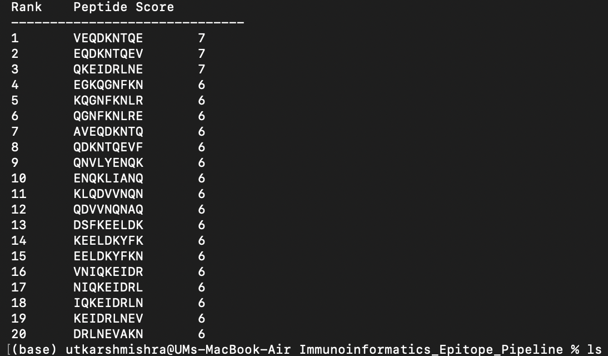

# Immunoinformatics Epitope Pipeline

A Python-based immunoinformatics workflow for identifying and ranking candidate peptide epitopes from protein sequences.

## Features

- FASTA protein sequence parsing
- Generation of overlapping 9-mer peptides
- Peptide scoring based on amino acid properties
- Ranking of candidate epitopes
- Automated report generation
- Pipeline execution through a single command

## Repository Structure

```
data/       Input FASTA files
scripts/    Analysis scripts
results/    Generated outputs
images/     Screenshots and figures
```

## Run Pipeline

```bash
python run_pipeline.py data/spike_protein.fasta
```

## Example Output



## Workflow

Protein Sequence
↓
Peptide Generation
↓
Peptide Scoring
↓
Epitope Ranking
↓
Report Generation

## Author

Utkarsh Mishra
M.Tech Bioinformatics
Delhi Technological University
